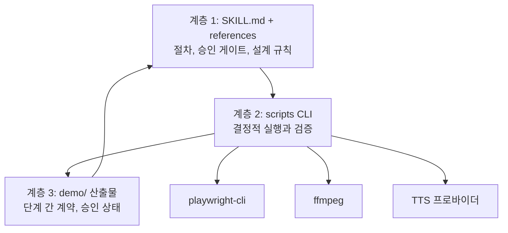
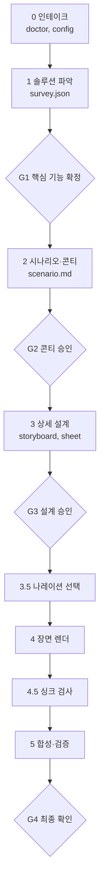

# demo-video 스킬 설계·구현 문서

기준일: 2026-09-17 · 작성: 양권상 · 수치 근거: `docs/PD-STANDARDS.md`

## 1. 개요

실행 중인 웹앱의 코드와 화면을 읽어 데모 영상(mp4)을 만드는 Agent Skill을, 개인 GitHub 저장소 하나로 팀에 배포한다. 기존 demo-video 초안을 기반으로 하며, 신규 개발이 아니라 "팀 배포용 이식 + 요구사항 갭 보완"이 작업의 본체다.

**목표**

- 팀원이 설치 명령 한 줄 후 "데모 영상 만들어줘" 한마디로 시작할 수 있다.
- Claude Code, Codex CLI, Grok Build에서 같은 저장소가 그대로 동작한다.
- 조사, 콘티, 상세 설계, 최종본의 네 지점에서 사용자 승인을 받고, 피드백은 해당 단계 산출물만 고쳐 하류만 재실행한다.

**하지 않을 것 (v1)**

- MCP 서버 제공, 원격 렌더 서버
- Remotion 기반 합성, AI 생성 BGM(파일로 가진 BGM을 까는 것은 범위 안), 음성 인식 자막, 장면별 다른 곡이나 효과음 연출
- PPT 생성 (후속 도구로 분리)
- 웹 채팅 UI 지원. 셸 실행이 가능한 CLI 에이전트만 대상이다.

**성공 기준**

| 번호 | 기준 |
| --- | --- |
| SC-001 | 새 팀원이 README만 보고 10분 안에 설치와 `doctor` 통과까지 마친다 |
| SC-002 | 5개 장면, 60초 이내 영상의 최종 렌더가 10분 안에 끝난다 |
| SC-003 | 자막 한 줄 수정 후 재생성은 해당 장면 렌더와 합성만 수행한다 |
| SC-004 | 모든 자막이 한 줄이고, 어떤 프레임에서도 페이지 요소나 줌에 가려지지 않는다 |
| SC-005 | Claude Code와 Codex에서 같은 storyboard.json으로 같은 영상이 나온다 |
| SC-006 | 콘티에 든 페이지의 드래그앤드롭, 스크롤 등 시스템별 상호작용이 모두 도출되고, show로 승인된 항목은 빠짐없이 최종 영상에 나타난다 |

## 2. 결정 사항과 가정

배포는 Skill, 실행 로직은 번들 CLI, MCP는 v1 제외로 확정한다.

| 항목 | 결정 | 근거 |
| --- | --- | --- |
| 배포 형태 | Agent Skills 표준 SKILL.md + Claude Code 플러그인 매니페스트 + AGENTS.md 폴백 | 승인 게이트가 있는 절차이고 작업 대상이 전부 로컬이다. 같은 파일이 Claude Code, Codex, Grok Build에서 읽힌다 |
| 저장소 | 개인 GitHub 비공개 저장소, 팀원은 collaborator | 사내 정보는 저장소에 넣지 않고 팀원 로컬 설정으로 분리 |
| 브라우저 조작·녹화 | playwright-cli, `page.screencast.*` | 초안에서 검증됨 |
| 자막·효과 렌더 | 브라우저 오버레이 | ffmpeg 빌드에 libass가 없어도 동작한다. 추가 의존성 없음 |
| 합성 | ffmpeg (결합, 페이드, 오디오 mux, 트랜스코딩만) | 텍스트 필터에 의존하지 않는다 |
| 인트로/아웃트로 | 사용자 영상이 있으면 정규화 후 결합, 없으면 HTML 템플릿을 같은 파이프라인으로 녹화 | 도구 추가 없이 요구사항 충족 |
| 나레이션 | 선택 기능. TTS 프로바이더 추상화 (`say`, `edge-tts`, `none`). 기본 속도는 약 350음절/분(`say` rate 150), 숫자·오류 문구는 rate 120 | 초안의 macOS `say` 고정을 해소. 아나운서 낭독 속도(약 355 SPM)에 맞춘다 |
| 품질 규칙 | 프롬프트가 아니라 검증 스크립트가 exit 1로 강제 | 모델마다 지시 준수도가 다르다 |
| 보안 | 전 과정 로컬 실행. 제품 화면을 외부 API로 보내지 않는다 | 미공개 제품 화면 보호 |

**가정** (틀리면 해당 절을 고친다)

- `[가정 A1]` 팀원 OS는 macOS가 다수이고 Windows가 일부 섞여 있다. 그래서 심볼릭 링크 실패 시 복사 폴백과 `edge-tts` 프로바이더를 둔다.
- `[가정 A2]` 스크립트 언어는 초안과 같은 Python 3.10 이상, 표준 라이브러리만 쓴다. pip 설치 단계를 없애기 위해서다.
- `[가정 A3]` 기본 출력은 1920×1080, 25fps, H.264 mp4다. 25fps는 Playwright 녹화의 고정값이다.
- `[가정 A4]` 대상 앱은 팀원이 로컬 또는 개발 서버에 직접 띄우고, 데모 계정도 팀원이 제공한다. 스킬은 앱을 기동하지 않는다.
- `[가정 A5]` edge-tts는 텍스트를 외부 서비스로 보낸다. 자막 문구가 대외비면 `say` 또는 `none`을 쓴다.

## 3. 아키텍처

절차는 SKILL.md가, 실행은 CLI가, 상태는 파일이 맡는 3계층이다. LLM은 계층 1만 읽고 계층 2를 호출하며, 계층 3을 통해서만 단계 사이에 정보를 넘긴다.



SKILL.md는 200줄 이내로 유지하고 상세는 references로 내린다. 에이전트는 필요한 단계의 reference만 읽는다.

**저장소 구조**

```
demo-video/
├── .claude-plugin/
│   ├── plugin.json            # Claude Code 플러그인 매니페스트
│   └── marketplace.json       # /plugin marketplace add 용
├── skills/demo-video/
│   ├── SKILL.md               # 단계, 게이트, 스크립트 호출법
│   ├── references/
│   │   ├── survey.md          # 코드·화면 조사 방법, survey.json 형식
│   │   ├── scenario.md        # 시나리오·콘티 작성법
│   │   ├── storyboard.md      # 스키마, 체류 시간 공식
│   │   ├── effects.md         # 자막·줌·클릭·하이라이트 규칙
│   │   ├── interactions.md    # 상호작용 신호 표, 담을지 판단, 액션별 표현
│   │   ├── screencast-api.md  # 장면 body 작성 계약
│   │   ├── narration.md
│   │   ├── compose.md
│   │   └── feedback.md        # 피드백 유형별 수정 파일과 재실행 범위
│   ├── scripts/
│   │   ├── dv.py              # 단일 진입점: dv.py <command>
│   │   ├── lib/               # 스키마 검증, 해시 캐시, ffmpeg·tts 래퍼
│   │   └── prelude.js         # 장면 body에 주입되는 헬퍼
│   └── assets/
│       ├── intro/default.html
│       ├── outro/default.html
│       ├── bgm/catalog.json   # 음원 묶음은 Release 자산, 저장소에는 카탈로그만
│       ├── bgm/LICENSES.md
│       └── theme.json         # 폰트, 색, 자막 스타일 기본값
├── examples/sample-app/       # 회귀 테스트용 최소 웹앱과 기준 storyboard
├── tests/
├── AGENTS.md                  # 스킬 미지원 도구용 폴백 안내
├── install.sh / install.ps1
├── VERSION
└── README.md
```

저장소 루트의 로컬 폴더 이름은 무엇이든 상관없다(현재 `~/Desktop/skills`). GitHub 저장소 이름만 `demo-video`로 둔다. `docs/`는 설계 문서 폴더로 루트에 둔다.

스크립트는 자기 위치를 기준으로 경로를 찾는다. 초안의 `~/.claude/skills/...` 절대 경로는 모두 제거한다. 작업 산출물은 스킬 폴더가 아니라 대상 프로젝트의 `demo/` 아래에 쓴다.

## 4. 산출물 계약

`demo/` 아래 파일이 단계 간 유일한 인터페이스이고, `storyboard.json`이 영상의 단일 진실 소스다.

| 파일 | 만드는 단계 | 내용 | 승인 |
| --- | --- | --- | --- |
| `config.json` | 0 인테이크 | 앱 URL, 해상도, 나레이션·TTS, BGM, 인트로/아웃트로 자산 경로, 목표 길이, 시청자 | 불필요 |
| `survey.json` | 1 조사 | 핵심 기능 순위, 라우트, 화면 흐름 그래프, 로케이터, 정보 밀도, 막힌 지점 | 핵심 기능 목록 |
| `scenario.md` | 2 콘티 | 주인공, 목표, 흐름과 각 단계의 위치 이유, 장면 아웃라인과 러닝타임 | 필수 |
| `storyboard.json` | 3 상세 설계 | 장면별 자막, 액션, 효과, 체류, 전환 | 필수 |
| `sheet.html` | 3 상세 설계 | 스텝별 스크린샷에 자막을 얹은 콘티 시트 | storyboard와 함께 |
| `narration.json` | 3.5 | 자막별 음성 파일, 길이, 쉼·강조 마크업 | 불필요 |
| `scenes/<id>.body.js`, `.webm`, `.timing.json` | 4 렌더 | 장면 소스, 클립, 실제 자막 큐 시각 | 불필요 |
| `output/<name>.mp4`, `.srt` | 5 합성 | 최종 영상 | 최종 |
| `state.json` | 전 단계 | 단계별 승인 여부와 승인 시점의 파일 해시 | - |

**스키마 버전.** 초안의 storyboard 형식은 `schemaVersion: 1`이고, M0은 이 형식을 그대로 이식한다. 아래 형식은 `schemaVersion: 2`이며 M2에서 `validate`와 함께 도입한다. 그 시점부터 회귀 기준은 초안으로 만든 기존 데모가 아니라 `examples/sample-app`이다.

**승인 상태.** `dv.py approve <stage>`가 해당 파일의 해시를 `state.json`에 기록한다. stage는 `survey`(survey.json), `scenario`(scenario.md), `storyboard`(storyboard.json), `final`(output mp4) 네 가지다. storyboard.json의 해시는 기계가 채우는 필드(`holdMs`, `dwellMs`, 스텝의 `narration` 마크업)를 제외한 정규형으로 계산한다. 그렇지 않으면 3.5단계 `narrate`가 G3 승인을 스스로 무효화한다. 하류 명령은 상류 파일의 해시가 승인 시점과 다르면 exit 1로 멈춘다. 승인 후 파일을 고치면 다시 승인받아야 한다는 규칙을 코드로 강제하는 장치다.

**storyboard.json 장면 예시**

```json
{
  "meta": { "name": "camino-demo", "size": [1920, 1080], "narration": false },
  "intro":  { "source": "html", "template": "default", "title": "Camino", "tagline": "E2E 테스트 자동화", "holdMs": 2500 },
  "outro":  { "source": "video", "path": "assets/outro.mp4" },
  "scenes": [
    {
      "id": "03-dashboard",
      "url": "/dashboard",
      "transitionIn": { "type": "fade", "ms": 400 },
      "steps": [
        {
          "subtitle": { "text": "실패한 테스트를 한눈에 확인합니다", "emphasis": "실패한 테스트" },
          "actions": [
            { "type": "zoom", "target": "[data-testid=fail-list]", "scale": 1.6, "ms": 600 },
            { "type": "highlight", "target": "[data-testid=fail-row-1]" },
            { "type": "click", "target": "[data-testid=fail-row-1]", "ripple": true },
            { "type": "zoomOut", "ms": 500 }
          ],
          "holdMs": 3200
        }
      ],
      "dwellMs": 9000
    }
  ]
}
```

액션 타입은 고정 목록이다. 기본 열 가지는 `goto`, `click`, `type`, `hover`, `scroll`, `waitFor`, `zoom`, `zoomOut`, `highlight`, `chapter`이고, 시스템별 상호작용용 아홉 가지는 `drag`, `dropFile`, `resize`, `slide`, `pan`, `wheelZoom`, `key`, `dblclick`, `rightClick`, 그리고 실시간 갱신용 `waitStream`이다. 목록 밖의 타입은 검증에서 거부한다. `holdMs`와 `dwellMs`는 사람이 직접 쓰지 않고 `dv.py validate --fix`가 공식으로 채운다.

각 장면은 6절 FR-060의 상호작용 도출 결과를 `interactions[]`로 함께 가진다.

```json
"interactions": [
  { "kind": "drag", "target": "[data-testid=case-card]", "evidence": { "source": "src/board/Board.tsx: dnd-kit useSortable", "screen": "카드 좌측 드래그 핸들" }, "decision": "show", "reason": "테스트 케이스 우선순위 변경이 시나리오의 핵심 작업" },
  { "kind": "hover", "target": ".status-badge", "evidence": { "source": "Tooltip 컴포넌트", "screen": "호버 시 상태 설명" }, "decision": "skip", "reason": "자막이 다루지 않는 보조 정보" }
]
```

## 5. 단계별 워크플로와 승인 게이트

게이트는 네 곳이고, 게이트를 통과하지 않으면 다음 단계의 스크립트가 실행되지 않는다.



각 게이트에서 수정 요청이 오면 그 단계의 산출물을 고치고 같은 게이트로 돌아온다. G4의 피드백은 아래 라우팅 표로 되돌아갈 단계를 정한다.

| 단계 | 에이전트가 하는 일 | 사용자에게 묻거나 보여주는 것 |
| --- | --- | --- |
| 0 인테이크 | `doctor` 실행, 부족한 의존성의 설치 명령 제안, `config.json` 작성 | 앱 URL과 계정, 시청자와 목적, 목표 길이, 나레이션 여부, BGM(기본 트랙 / 내 파일 / 없음), 인트로/아웃트로 영상 보유 여부 |
| 1 솔루션 파악 | 라우트·내비·권한 가드·i18n 파일을 읽고, 실제 화면을 순회해 로케이터와 스크린샷 수집 | 핵심 기능 3~5개 순위, 화면 흐름, 막힌 지점(404, 데이터 없음, 권한 부족) |
| 2 시나리오·콘티 | 주인공과 목표 정의, 인트로/페이드인/본문/페이드아웃/아웃트로 골격에 장면 배치, 컨셉 프로필로 BGM 후보 선정 | 장면 아웃라인과 러닝타임 표, BGM 1순위와 대안 2곡. 90초 초과 시 분할 제안 |
| 3 상세 설계 | 페이지별 소스와 화면에서 상호작용 도출(FR-060), 스텝별 자막·액션·효과 작성, `validate --fix`, `sheet` 생성 | 콘티 시트(그림으로 확인), 페이지별 상호작용 목록과 show/skip 결정, 재현이 막힌 항목 |
| 3.5 나레이션 | `narrate`로 음성 생성, hold/dwell 확장 | 늘어난 러닝타임만 보고 |
| 4 렌더 | 장면별 body 작성, `render` | 없음 |
| 4.5 싱크 | `check-sync` 실패 시 해당 장면만 수정 후 재렌더 | 없음 |
| 5 합성 | `compose`, `verify` 프레임 타일과 볼륨으로 실제 확인 | 없음 |
| 5.5 레드팀 검토 | `review` 패킷을 PD·시청자·평론가로 검토해 `review.md` 작성, `fail`은 고쳐서 재검토 | 판정, 남은 warn/note, 영상 경로, 러닝타임, 나레이션·BGM 포함 여부 |

**피드백 라우팅** (`references/feedback.md`에 같은 표를 둔다)

| 피드백 | 고칠 파일 | 재실행 범위 |
| --- | --- | --- |
| 자막 문구, 강조 단어 | storyboard 해당 스텝 | (narrate) → 해당 장면 render → compose |
| 줌·클릭 효과, 체류 시간 | storyboard 해당 스텝 | 해당 장면 render → compose |
| 장면 순서 변경, 장면 삭제 | storyboard scenes 배열 | compose만 |
| 장면 추가, 다른 기능을 보여달라 | scenario → storyboard | G2부터 다시 |
| 인트로/아웃트로 교체, 전환 효과 | storyboard intro/outro/transition | 인트로 장면 render(HTML인 경우) → compose |
| 목소리, 말 속도 | config tts | narrate → 전체 render → compose |
| BGM 교체, 음량 | config bgm | compose만 |
| 핵심 기능 자체가 틀렸다 | survey | G1부터 다시 |
| 이 조작(드래그, 스크롤 등)도 보여달라, 빼달라 | storyboard 해당 장면의 interactions 결정과 스텝 | validate → 해당 장면 render → compose |

## 6. 영상 효과 설계 규칙

모든 규칙은 `prelude.js`의 헬퍼와 `validate`가 강제하며, 에이전트는 storyboard에 값만 쓴다.

**화면 레이어 구조.** 요구사항의 "자막은 전체 화면 기준, 최상단"과 "줌인"이 충돌하지 않도록 레이어를 셋으로 나눈다.

| 레이어 | 내용 | 줌 적용 |
| --- | --- | --- |
| L3 자막 | 자막, 챕터 카드, 키 캡 표시 | 받지 않음 |
| L2 효과 | 클릭 리플, 하이라이트 박스, 커서 | 좌표가 따라감. 오버레이를 `boundingBox()`의 transform 반영 좌표로 그린다 |
| L1 앱 | 대상 웹앱 | 받음 |

- L3는 `page.screencast.showOverlay`를 그대로 쓴다. 스파이크(2026-09-17)로 확인한 사실: 오버레이는 `<x-pw-glass popover="manual">`로 `<html>` 직속 자식(`<body>`의 형제)에 붙어 top layer에 올라가며, `body`나 `html`의 transform에 영향을 받지 않는다. 별도 DOM 오버레이는 만들지 않는다.
- 줌은 `document.body`에 `transform: scale()`을 건다. `transform-origin`은 대상 요소 중심(body 좌표계), 줌 중에는 `html { overflow: hidden }`. 앱 DOM을 감싸는 래퍼는 만들지 않는다(`position: fixed`, 포털 모달이 깨진다). 줌 상태에서 `locator.click()`이 확대된 요소를 정확히 맞추는 것을 확인했다.
- L2는 `zoom`/`zoomOut` 헬퍼가 전환 완료를 기다린 뒤에만 그린다. 전환 중에 그린 좌표는 어긋난다.

**자막 (FR-010 ~ FR-014)**

| 번호 | 규칙 |
| --- | --- |
| FR-010 | 위치는 프레임 가로 중앙, 하단에서 프레임 높이의 7% 위. 뷰포트 기준 `position: fixed`라 스크롤과 무관하다 |
| FR-011 | 한 줄만 허용한다. `white-space: nowrap`이고 최대 폭은 프레임의 86% |
| FR-012 | 글자 수 상한은 가중 32자로 고정한다. 한글 1, 라틴 문자·공백·문장부호 0.5로 센다(Netflix 한국어 기준 16자×2줄). 별도로 `32 × fontSize ≤ 0.86 × 프레임 폭`을 `validate`가 확인한다. 초과하면 `validate`가 실패하고 에이전트는 문장을 두 큐로 나눈다. 글자를 줄이거나 줄바꿈하지 않으며, `text-overflow: ellipsis`로 잘라내지 않는다 |
| FR-013 | 노출 시간은 읽기 시간 이상. `holdMs = clamp(글자수 × 125ms + 600, 1500, 7000)` (8자/초, Netflix 상한 12자/초의 2/3). 7000을 넘는 문장은 두 큐로 나눈다. 나레이션이 있으면 `max(읽기, 음성 길이 + 400)`. 연속 큐 사이 간격은 300ms |
| FR-014 | 반투명 어두운 배경 박스에 흰 글자. 밝은 화면과 어두운 화면 모두에서 읽혀야 한다. 문구는 제품의 i18n 용어를 쓰고, 커서 동작이 아니라 사용자가 할 수 있는 일을 말한다 |

**줌 (FR-020 ~ FR-022)**

- FR-020: `zoom`은 대상 요소의 중심을 기준으로 확대한다. 배율은 1.2~2.0, 기본 1.5. 대상이 프레임의 60% 이상을 이미 차지하면 `validate`가 경고한다.
- FR-021: 진입 600ms, 복귀 500ms의 ease-in-out. 한 스텝에 줌은 한 번만 쓴다. 장면이 끝나기 전에 반드시 `zoomOut`으로 돌아온다.
- FR-022: 줌은 "정보 밀도가 높은 화면에서 한 곳을 읽혀야 할 때"만 쓴다. survey의 밀도 값이 낮은 화면에는 쓰지 않는다.

**클릭과 하이라이트 (FR-030 ~ FR-032)**

- FR-030: 모든 `click`은 커서 이동(300~500ms) → 리플 → 실제 클릭 순서다. 커서가 순간이동하지 않는다.
- FR-031: `highlight`는 대상 둘레에 2px 테두리와 바깥 딤 처리. 1.2초 후 자동 해제.
- FR-032: `type`은 글자당 60ms로 타이핑한다. 비밀번호 필드는 즉시 채우고 화면에 노출하지 않는다.

**시스템별 상호작용 도출 (FR-060 ~ FR-065)**

드래그앤드롭, 스크롤처럼 그 시스템에서만 경험할 수 있는 조작은 3단계의 페이지별 효과 도출에서 찾아내고, 필요한 것은 영상에 반드시 담는다. 대상은 승인된 콘티에 들어간 페이지로 한정해 조사 비용을 줄인다.

| 번호 | 규칙 |
| --- | --- |
| FR-060 | 에이전트는 콘티의 각 페이지에 대해 소스 신호와 화면 신호를 모두 확인해 상호작용 목록을 만들고, storyboard 장면의 `interactions[]`에 기록한다 |
| FR-061 | 항목마다 `decision`을 `show` 또는 `skip`으로 정하고 이유를 한 줄 적는다. 판단 기준은 아래 "담을지 판단"을 따른다 |
| FR-062 | `show` 항목은 그 장면의 스텝에 대응하는 액션이 있어야 한다. 없으면 `validate`가 실패한다 |
| FR-063 | 소스에는 있는데 화면에서 재현되지 않는 항목(데이터 부족, 권한 없음)은 `blocked`로 표시하고 G3에서 사용자에게 알린다 |
| FR-064 | 콘티 시트는 페이지마다 상호작용 목록과 show/skip 결정을 배지로 보여준다. 사용자는 G3에서 결정을 뒤집을 수 있다 |
| FR-065 | 상호작용이 기능 그 자체인 경우(칸반 보드의 카드 이동, 워크플로 캔버스의 노드 연결)는 1단계 핵심 기능 목록에 먼저 올라온다. 3단계는 그 표현 방법을 정한다 |

**찾는 방법.** 한쪽 신호만으로 확정하지 않는다. 소스에만 있으면 죽은 코드일 수 있고, 화면에만 보이면 동작 방식을 알 수 없어 재현에 실패한다.

| 상호작용 | 소스 신호 | 화면 신호 |
| --- | --- | --- |
| 드래그앤드롭, 정렬 | dnd-kit, react-dnd, SortableJS, react-beautiful-dnd 임포트, `draggable`, `onDrop`, `onDragStart` | 드래그 핸들 아이콘, `aria-grabbed`, `cursor: grab` |
| 파일 드롭 업로드 | react-dropzone, `input[type=file]`, `onDrop` + `dataTransfer.files` | 점선 드롭 영역, "파일을 끌어다 놓으세요" 문구 |
| 스크롤로 드러나는 내용 | IntersectionObserver, 무한 스크롤 훅, 가상 리스트(react-window, tanstack-virtual), `position: sticky`, scroll-snap | `scrollHeight`가 `clientHeight`보다 큼, 내부 스크롤 컨테이너, 스크롤 시 고정되는 헤더 |
| 호버 | Tooltip·Popover 컴포넌트, `onMouseEnter`, `:hover`에서만 보이는 액션 버튼 | `title`, `aria-describedby`, 호버 전후 스냅샷 차이 |
| 크기 조절, 분할 패널 | react-resizable-panels, `resize` 핸들러, `cursor: col-resize` | 패널 사이 구분 핸들, `role=separator` |
| 슬라이더, 범위 선택 | `input[type=range]`, Slider 컴포넌트, 날짜 범위 피커 | `role=slider`, `aria-valuenow` |
| 캔버스 조작 | React Flow, konva, d3-zoom, `onWheel` | `canvas`·`svg` 대형 영역, 미니맵, 확대 컨트롤 |
| 키보드 | 단축키 훅(hotkeys), `onKeyDown`, 커맨드 팔레트 | 단축키 표기(⌘K), `kbd` 요소 |
| 인라인 편집, 다중 선택 | `onDoubleClick`, `contentEditable`, shift·ctrl 선택 로직 | 더블클릭 시 입력창 전환, 체크박스 열과 일괄 작업 바 |
| 우클릭 메뉴 | `onContextMenu`, ContextMenu 컴포넌트 | 우클릭 시 나타나는 `role=menu` |
| 실시간 갱신 | SSE, WebSocket, 스트리밍 응답 처리, 폴링 | 진행률 바, 토큰 단위로 늘어나는 텍스트, 상태 배지 변화 |

에이전트 제품은 마지막 행이 특히 중요하다. 응답이 스트리밍되거나 단계별 진행 상태가 바뀌는 모습이 제품의 핵심 경험인 경우가 많다.

**담을지 판단.** 아래 중 하나라도 해당하면 `show`다.

- 시나리오의 작업을 그 조작 없이는 끝낼 수 없다.
- 그 조작을 해야만 보이는 정보가 자막이 말하는 내용이다. (스크롤해야 나오는 결과 요약, 호버해야 나오는 상세 수치)
- 경쟁 제품 대비 차별점이거나 사용자가 "이게 되네" 하고 느낄 지점이다.

해당하지 않으면 `skip`이다. 모든 툴팁과 모든 스크롤을 보여주면 영상이 길어지고 초점이 흐려진다. 장면당 `show`는 2개 이하를 권장하고, 넘으면 `validate`가 경고한다.

**영상에서 표현하는 방법**

| 액션 | 재생 방식 | 함께 쓰는 효과 |
| --- | --- | --- |
| `drag` | 커서를 원본으로 이동 → 누름 표시(커서 축소와 링) → 8~12개 중간 지점을 거쳐 600~900ms 동안 이동 → 대상 위에서 200ms 멈춤 → 놓음 리플 | 드롭 대상 `highlight`, 이동 거리가 멀면 줌 없이, 작은 목록 안이면 `zoom` 후 드래그 |
| `dropFile` | 화면 밖에서 파일 아이콘 고스트가 드롭 영역으로 들어오는 오버레이 → 실제 파일 주입 | 드롭 영역 `highlight` |
| `scroll` | 대상 컨테이너를 ease-in-out으로 스크롤. 속도는 초당 뷰포트 높이의 60% 이하. 도착 후 최소 800ms 정지 | 고정 헤더 등 "스크롤해도 남는 것"이 포인트면 자막으로 짚는다 |
| `hover` | 커서 이동 후 툴팁이 뜰 때까지 대기, 최소 1200ms 유지 | 툴팁이 작으면 `zoom` |
| `resize` | `drag`와 같은 방식으로 핸들을 이동 | 없음 |
| `slide` | 슬라이더 손잡이를 드래그하고, 값 변화에 따라 바뀌는 영역이 함께 보이도록 프레임을 잡는다 | 결과 영역 `highlight` |
| `pan`, `wheelZoom` | 캔버스 위에서 드래그 또는 휠 이벤트를 단계적으로 보낸다 | 없음. 페이지 `zoom`과 동시에 쓰지 않는다 |
| `key` | 키 입력과 동시에 화면 하단 좌측에 키 캡 오버레이(예: ⌘ K)를 1초 표시 | L3 레이어에 그린다 |
| `dblclick`, `rightClick` | 리플을 두 번 또는 다른 색으로 표시 | 없음 |
| `waitStream` | 스트리밍이나 진행 상태가 끝나는 조건까지 기다린다. 15초를 넘으면 `stream` 마크를 남기고 `compose`가 보고한다. 구간 배속과 "배속" 표시는 M4 이후 과제다 | 완료 시점에 결과 `highlight` |

스크롤 중에도 자막은 L3에 고정되어 움직이지 않는다. 드래그 중 커서와 누름 표시는 L2라 줌과 함께 확대된다.

**인트로·아웃트로·전환 (FR-040 ~ FR-043)**

| 번호 | 규칙 |
| --- | --- |
| FR-040 | 기본 구조는 인트로 → 페이드인 → 본문 장면들 → 페이드아웃 → 아웃트로로 고정한다 |
| FR-041 | 사용자가 영상을 주면 `compose`가 해상도·fps·코덱을 본문과 맞춰 정규화한 뒤 붙인다. 비율이 다르면 레터박스하고 그 사실을 보고한다 |
| FR-042 | 영상이 없으면 `assets/intro/default.html`에 제목·태그라인·로고를 주입해 녹화한다. 사용자가 새 디자인을 원하면 에이전트가 HTML을 새로 작성해 `demo/assets/`에 두고 같은 경로로 녹화한다 |
| FR-043 | 장면 사이 전환은 기본 `fade` 400ms, 허용 범위 300~700ms. 같은 페이지 안에서 이어지는 장면은 `cut`. 전환은 ffmpeg `xfade`로 합성 단계에서 넣는다 |
| FR-044 | 인트로는 2.5초 이하. 인트로 다음 첫 자막은 시청자의 목표나 문제를 말하는 문장이며 `hook: true`로 표시한다(첫 5초 안에 문제 제시). 아웃트로는 다음 행동(CTA) 한 줄을 갖고 2~4초다 |
| FR-045 | 목표 길이는 사용자가 정한다(`init --target-sec`, `config.video.targetSec`). 2단계는 이 값을 장면 예산으로 배분해 콘티를 짜고, `validate`는 추정 길이가 목표의 ±15%를 벗어나면 경고한다(짧아도 경고, 실패는 없음). 목표가 없을 때만 기본값 90초 초과 경고와 분할 제안 |

**BGM (FR-070 ~ FR-078)**

스킬은 라이선스를 확인한 가사 없는 트랙 묶음과 감성 태그 카탈로그를 갖고, 솔루션 컨셉에 맞는 곡을 스스로 골라 깐다. 사용자가 파일을 주면 그 파일을 쓴다.

| 번호 | 규칙 |
| --- | --- |
| FR-070 | 우선순위는 사용자 제공 파일 → 카탈로그 자동 선택 → 없음(`bgm: none`) 순이다 |
| FR-071 | 번들 트랙은 CC0만 기본으로 넣는다. CC BY 트랙은 `requiresAttribution: true`로 구분하고, 선택되면 `compose`가 `output/CREDITS.txt`에 표기 문구를 쓰고 에이전트가 사용자에게 "영상 설명이나 아웃트로에 표기 필요"를 알린다 |
| FR-072 | `catalog.json`의 트랙마다 출처 URL, 라이선스, 라이선스 확인 날짜, 파일 sha256을 기록한다. 원 사이트가 사라져도 근거가 남게 하기 위해서다 |
| FR-073 | 감성 태그는 통제 어휘만 쓴다. mood: `calm`, `focused`, `warm`, `bright`, `confident`, `inspiring`, `playful`, `futuristic`, `serious`. 여기에 `energy` 1~5, `bpm`, `density`(sparse, medium, busy), `loopable`, `vocals: false`를 둔다 |
| FR-074 | 태그는 출처 메타데이터로 1차 입력하고, 사람이 실제로 듣고 확정한 트랙만 `verified: true`가 된다. 자동 선택은 `verified` 트랙만 대상으로 한다 |
| FR-075 | 2단계에서 에이전트가 `scenario.md`로부터 컨셉 프로필(시청자, 톤, 도메인, 장면 전환 속도, 나레이션 유무)을 만들고, `dv.py bgm pick`이 점수를 매겨 상위 3곡과 이유를 돌려준다. 점수 계산은 코드가 하므로 어느 모델을 쓰든 같은 곡이 나온다 |
| FR-076 | 나레이션이 있으면 `energy` 3 이하, `density`가 `busy`가 아닌 곡만 후보다. 목소리와 멜로디가 경쟁하지 않게 하기 위해서다 |
| FR-077 | 선택 결과는 G2 콘티 승인 때 1순위와 대안 2곡으로 함께 보여준다. 교체는 `compose`만 다시 돌린다 |
| FR-078 | `compose`는 영상 길이에 맞춰 루프, 인트로 페이드인 1.5초, 아웃트로 페이드아웃 2초, 최종 통합 라우드니스 -16 LUFS·트루피크 -1 dBTP(웹 배포 기준), 나레이션 구간 더킹 -18 dB(어택 300ms, 릴리즈 800ms)를 적용한다. 사용자 제공 파일에도 같은 처리를 한다 |

**컨셉에서 곡으로 가는 매핑 (기본값)**

| 컨셉 신호 | mood | energy | 예 |
| --- | --- | --- | --- |
| 임원·의사결정자 대상, 신뢰와 안정 강조 | `confident`, `warm` | 2~3 | 규제 추적, 품질 평가 플랫폼 |
| 실무자 대상, 업무 효율과 절차 시연 | `focused`, `calm` | 2 | 테스트 자동화, 문서 분석 도구 |
| 개발자 대상, 기술 데모 | `futuristic`, `focused` | 3 | 에이전트 개발 도구, 코드 분석 |
| 신제품 소개, 가능성 강조 | `inspiring`, `bright` | 3~4 | 해커톤 발표, 신규 서비스 |
| 가볍고 친근한 서비스 | `playful`, `bright` | 3 | 사내 생산성 도구 |

**조사한 음원 출처** (2026-09-17 확인)

| 출처 | 라이선스 | 번들 | 성격 |
| --- | --- | --- | --- |
| [HoliznaCC0 (Free Music Archive)](https://freemusicarchive.org/music/holiznacc0/) | CC0 | 가능 | 679곡. 로파이·칠 위주, 신스웨이브와 칩튠 앨범도 있음. [Public Domain Lofi](https://freemusicarchive.org/music/holiznacc0/public-domain-lofi)는 곡 제목에 Calm, Bright, Happy, Motivating 같은 분위기 표기가 붙어 있어 1차 태깅에 유리 |
| [Maarten Schellekens, PUBLIC DOMAIN (FMA)](https://freemusicarchive.org/music/maarten-schellekens/public-domain-1) | CC0 | 가능 | 어쿠스틱, 재즈, 앰비언트. 일부 보컬 곡이 섞여 있어 선별 필요 |
| [OpenGameArt CC0 Upbeat / Electronic 모음](https://opengameart.org/content/cc0-upbeat-electronic-music) | CC0 | 가능 | 일렉트로닉, 신스. 게임 음악 색이 강해 기술 데모용으로만 선별 |
| [Chosic CC0 필터](https://www.chosic.com/free-music/all/?sort=&attribution=no) | 곡마다 다름 | 곡별 확인 | 모음 사이트. 원 출처의 라이선스를 곡마다 다시 확인해야 함 |
| [free-stock-music.com Corporate](https://www.free-stock-music.com/corporate.html) | 대부분 CC BY 4.0 | 표기 조건부 가능 | 전형적인 기업 홍보 영상 사운드. BPM과 분위기 태그 제공 |
| [Pixabay Music](https://pixabay.com/service/faq/) | Pixabay Content License | 불가 | 영상에 쓰는 것은 되지만 음원 파일을 그대로 배포하는 것은 금지. 팀원이 개별로 받아 "내 파일"로 쓰는 것은 가능 |
| FreePD.com | CC0 | 출처 소멸 | 사이트가 폐쇄됨. 미러가 있으나 출처를 검증할 수 없어 쓰지 않는다 |

조사에서 확인한 한계가 하나 있다. 밝고 고양되는 전형적 "기업 홍보" 사운드는 CC0로는 드물고 대부분 CC BY다. CC0 묶음은 로파이, 앰비언트, 일렉트로닉 쪽으로 기운다. `inspiring` 계열을 채우려면 CC BY 트랙을 표기 조건으로 받아들이거나 회사 계약 음원을 쓴다.

**배포 방식.** 20곡을 128kbps로 다시 인코딩해도 60MB 안팎이라 git 저장소에 직접 넣지 않는다. `catalog.json`만 저장소에 두고, 음원 묶음은 GitHub Release 자산으로 올려 `dv.py bgm fetch`가 첫 사용 때 받아 sha256을 검증한다.

## 7. CLI 스크립트 명세

진입점은 `python3 <skill>/scripts/dv.py <command>` 하나이고, 모든 명령은 대상 프로젝트 루트에서 실행해 `demo/`를 읽고 쓴다.

| 명령 | 입력 → 출력 | 핵심 동작 | 실패 조건 (exit 1) |
| --- | --- | --- | --- |
| `doctor` | 환경 → 점검표 | python, node, playwright-cli와 버전, ffmpeg와 `xfade` 필터, TTS 프로바이더, 스킬 버전과 원격 VERSION 비교. 부족한 항목마다 OS별 설치 명령 출력 | 필수 의존성 누락 |
| `init` | 인테이크 답 → `config.json`, `state.json` | `demo/` 골격 생성, `.gitignore`에 `demo/scenes/*.webm`, `demo/output/`, 인증 상태 파일 추가 | 앱 URL 접속 불가 |
| `survey shots` | survey의 라우트 목록 → 스크린샷, 접근성 스냅샷 | 코드 분석은 에이전트가 하고, 이 명령은 화면 순회의 반복 작업만 맡는다. 로그인 상태를 `demo/.auth/state.json`에 저장해 재사용 | 라우트 절반 이상 실패 |
| `validate [--fix]` | storyboard → 검증 결과 | 스키마, 액션 타입, 자막 길이(FR-012), 노출 시간(FR-013), 줌 규칙(FR-020~022), 로케이터가 survey에 있는지, show 상호작용에 대응 액션이 있는지(FR-062), evidence의 소스·화면 근거가 둘 다 채워졌는지. `--fix`는 hold/dwell만 채운다 | 규칙 위반 1건 이상 |
| `sheet` | storyboard + 스크린샷 → `sheet.html` | 스텝마다 스크린샷에 자막과 줌 영역을 그려 한 페이지로 만든다. 렌더 없이 수 초 안에 끝난다 | validate 미통과 |
| `approve <stage>` | 파일 → `state.json` | 승인 시점의 해시 기록 | 대상 파일 없음 |
| `narrate [--dry-run]` | storyboard → 음성 파일, `narration.json` | 절 경계 쉼, 숫자·오류 문구 감속, 강조어 처리. hold/dwell 확장을 storyboard에 다시 쓴다 | TTS 프로바이더 없음 |
| `render [scene] [--draft] [--jobs N]` | storyboard + body → `.webm`, `.timing.json` | body를 prelude로 감싸 녹화, 꼬리 정지 구간 트림, 해시 캐시로 변경 없는 장면은 건너뛴다 | G3 미승인, body 실행 오류 |
| `check-sync` | storyboard, body, narration, timing → 결과 | 스텝 수와 자막 호출 수, 자막 문구 일치, 음성 파일 존재, 큐 노출 시간이 음성 길이 이상인지 | 불일치 1건 이상 |
| `compose [--draft]` | 클립들 → mp4, srt | 인트로/아웃트로 정규화, `xfade` 전환, 나레이션 mux, BGM 처리(FR-078), H.264 1회 인코딩 | check-sync 미통과 |
| `verify` | mp4 → 프레임 타일, 음량 수치 | 장면마다 1프레임을 뽑아 타일 이미지 생성, 나레이션 큐 1곳과 무음 1곳의 `max_volume` 측정, 통합 LUFS와 트루피크 측정, 줌 구간 프레임에서 자막 박스가 타이틀 세이프(88%) 안에 있는지 검사 | 검은 프레임, 나레이션 구간 무음, LUFS가 목표 ±1 LU 밖, 자막이 안전 영역 밖 |
| `review` | mp4, storyboard, timing → `output/review.json`, 장면별 스트립, 전환 스트립 | 계획 대비 클립 길이, storyboard 액션 ↔ 녹화 마크 대조(빠진 효과), 자막 수·문구·간격, 장면마다 첫 프레임·자막 시작·효과 시점·끝 프레임 스트립, 전환 경계 전후 프레임, 4초 이상 정지 구간. 에이전트는 이 패킷을 PD·시청자·평론가 세 페르소나로 검토해 `demo/review.md`를 쓴다(`references/review.md`) | 효과 마크 누락, 자막 불일치 |
| `status` | `state.json` → 현재 단계 | 어느 게이트까지 통과했고 다음에 무엇을 할지 출력. 세션이 끊긴 뒤 에이전트가 이어받을 때 쓴다 | - |
| `bgm fetch / pick / probe` | catalog.json, 컨셉 프로필 → 음원 묶음, 상위 3곡, 사용자 파일 측정값 | fetch는 Release 자산을 받아 sha256 검증. pick은 verified 트랙만 대상으로 점수 계산(FR-075, FR-076). probe는 사용자 제공 파일의 길이와 음량을 재고 config에 등록 | sha256 불일치, 조건에 맞는 verified 트랙 없음 |

**장면 body 계약.** `scenes/<id>.body.js`는 문장만 담는다. `require`, `import`, 래퍼 함수를 쓰지 않는다. 스코프에 이미 있는 헬퍼는 `intro`, `outro`, `subtitle`, `subtitleSpan`, `chapter`, `click`, `typeText`, `zoom`, `zoomOut`, `highlight`, `dwell`, `BASE`, `ACCOUNTS`(`demo/.accounts.json`, gitignore), `HOLD`(장면의 자막 hold 배열)다. `// ---record---` 위의 문장은 녹화 전에 실행되어 로그인 같은 설정을 화면 밖에서 한다. `demo/prelude.js`가 있으면 프로젝트 전용 헬퍼로 함께 주입된다. 시간이 걸리는 헬퍼는 스스로 대기하므로 뒤에 `wait`를 붙이지 않는다. 상세는 `references/screencast-api.md`에 둔다.

**body 생성 옵션.** 액션 타입이 고정되어 있으므로 `render`는 body 파일이 없으면 storyboard에서 자동 생성한다. 드래그, 파일 드롭, 스크롤 같은 상호작용 액션도 자동 생성 대상이다. 에이전트가 body를 직접 쓰는 것은 조건 분기나 앱 고유의 복합 제스처처럼 액션 목록으로 표현되지 않는 장면뿐이다. 모델별 편차를 줄이는 가장 큰 장치다.

**상호작용 헬퍼.** prelude는 `drag`, `dropFile`, `scrollTo`, `hoverOn`, `resize`, `slide`, `pan`, `wheelZoom`, `key`, `dblclick`, `rightClick`, `waitStream`을 추가로 제공한다. `drag`는 대상 라이브러리에 따라 방식이 다르므로 `mode`를 받는다. `pointer`는 마우스 누름과 단계 이동(dnd-kit, SortableJS 등 포인터 기반), `html5`는 `dragstart`·`dragover`·`drop` 이벤트와 DataTransfer 주입(네이티브 `draggable` 기반)이다. 에이전트는 소스 신호로 `mode`를 정해 storyboard에 적는다.

## 8. 생성 최적화

녹화는 실시간이라 렌더 시간의 하한은 영상 길이다. 그래서 최적화의 핵심은 "다시 녹화하지 않는 것"이다.

| 번호 | 기법 | 효과 |
| --- | --- | --- |
| FR-050 | 장면 해시 캐시. 키는 장면 JSON + body + prelude 버전 + 해상도 + 나레이션 길이. 같으면 `render`가 건너뛴다 | 자막 한 줄 수정 시 장면 1개만 재녹화 (SC-003) |
| FR-051 | 렌더 전 검증을 앞에 둔다. `validate`와 `sheet`는 녹화 없이 수 초에 끝나므로, 승인 전 수정은 전부 여기서 흡수한다 | 승인 전 렌더 0회 |
| FR-052 | 드래프트 모드. 960×540, 나레이션 제외, 전환은 cut | 첫 확인용 영상이 절반 이하 시간에 나온다 |
| FR-053 | 로그인 상태 재사용. 로그인 장면을 제외한 모든 장면은 저장된 인증 상태로 시작한다 | 장면당 수 초 절약, 장면 독립 실행 가능 |
| FR-054 | 고정 sleep 금지. 페이지 준비는 `waitFor` 조건으로만 기다린다. 체류는 `dwell`만 담당한다 | 죽은 시간 제거, 느린 환경에서도 같은 결과 |
| FR-055 | 병렬 렌더 `--jobs N`. 장면에 `mutates: true`가 있으면 그 장면과 이후 장면은 순차 실행한다 | 읽기 전용 장면이 많을수록 단축 |
| FR-056 | 인코딩은 마지막에 한 번. 중간 클립은 webm 그대로 두고 `compose`에서만 H.264로 변환한다 | 화질 손실과 시간 중복 제거 |
| FR-057 | 인트로/아웃트로 클립 캐시. 제목과 템플릿이 같으면 재사용한다 | 프로젝트 간 재사용 |

데이터를 바꾸는 장면(등록, 삭제)이 있으면 재렌더마다 앱 상태가 달라진다. 인테이크에서 시드 데이터 리셋 방법을 묻고 `config.json`의 `resetCommand`에 기록해, `render`가 해당 장면 전에 실행한다.

## 9. 배포·설치·업데이트

팀원이 실행할 것은 설치 한 줄과 업데이트 한 줄이고, 환경 점검은 첫 사용 때 에이전트가 `doctor`로 대신한다.

**설치 스크립트 동작** (`install.sh`, Windows는 `install.ps1`)

1. 저장소를 `~/.agent-skills/demo-video`에 clone한다. 이미 있으면 `git pull`한다.
2. `skills/demo-video`를 `~/.claude/skills/demo-video`와 `~/.agents/skills/demo-video`에 심볼릭 링크한다. Grok Build는 Claude Code 경로를 함께 읽으므로 추가 작업이 없다.
3. 링크에 실패하면(Windows 개발자 모드 꺼짐) 복사로 폴백하고, 업데이트 때 다시 복사해야 한다고 알린다.
4. `dv.py doctor`를 실행해 결과를 보여준다.

**README에 담을 것은 세 가지뿐이다.**

```
# 설치 (비공개 저장소라 gh 로그인 또는 SSH 키가 필요합니다)
git clone git@github.com:<owner>/demo-video.git ~/.agent-skills/demo-video && ~/.agent-skills/demo-video/install.sh

# 업데이트
~/.agent-skills/demo-video/install.sh

# 사용: 데모할 프로젝트 폴더에서 에이전트에게
"이 프로젝트 데모 영상 만들어줘. 앱은 http://localhost:3000 에 떠 있어."
```

비공개 저장소는 `curl | bash` 방식이 인증 때문에 막히므로 clone 후 실행으로 통일한다. Claude Code만 쓰는 팀원은 `/plugin marketplace add <owner>/demo-video` 경로도 쓸 수 있고, README 하단에 대안으로만 적는다.

**버전 관리**

- `VERSION` 파일에 semver를 두고 태그를 건다. `doctor`가 원격 VERSION과 비교해 새 버전을 알린다.
- storyboard 스키마에 `schemaVersion`을 둔다. 스키마가 바뀌면 `validate`가 마이그레이션 안내를 출력한다.
- 저장소에 넣지 않는 것: 사내 URL, 계정, 제품 스크린샷, 회사 로고 원본. 팀 공용 로고와 테마는 각자 `~/.config/demo-video/theme.json`에 두고, 없으면 기본 테마를 쓴다.

**AGENTS.md 폴백.** 스킬을 자동 인식하지 못하는 도구를 위해 "데모 영상 요청을 받으면 `~/.agent-skills/demo-video/skills/demo-video/SKILL.md`를 먼저 읽어라" 한 문단만 둔다. 팀원은 이 문단을 자기 프로젝트의 AGENTS.md에 붙여 넣는다.

## 10. 구현 작업 계획

마일스톤은 다섯 개이고, M1이 끝나면 팀원이 설치할 수 있으며 M3이 끝나면 요구사항을 모두 충족한다. 각 마일스톤은 앞 단계만으로도 동작하는 상태로 끝낸다.

**M0. 저장소 골격과 초안 이식**

- [ ] 비공개 저장소 생성, 3절의 디렉터리 구조 커밋
- [ ] 초안 SKILL.md와 references, scripts를 `skills/demo-video/`로 이동
- [ ] 스크립트를 `dv.py` 단일 진입점의 하위 명령으로 통합
- [ ] `~/.claude/skills/...` 절대 경로를 스크립트 위치 기준 상대 경로로 교체
- [ ] SKILL.md에서 "Verified on this machine" 류의 머신 종속 문장 제거, ffmpeg 제약은 `doctor` 결과를 따르도록 수정
- 완료 기준: 초안을 만든 머신에서 새 경로로 기존 데모가 그대로 다시 만들어진다.

**M1. 설치와 환경 점검**

- [ ] `doctor` 구현 (의존성, 버전, ffmpeg 필터, TTS, 원격 VERSION 비교)
- [ ] `install.sh`, `install.ps1`, 심볼릭 링크와 복사 폴백
- [ ] `.claude-plugin/plugin.json`, `marketplace.json`, `AGENTS.md`, README
- [ ] `init`, `status`, `approve`와 `state.json` 해시 게이트
- 완료 기준: 초안을 본 적 없는 팀원 1명이 README만으로 설치하고 `doctor`를 통과한다 (SC-001).

**M2. 효과와 검증 (요구사항 갭의 핵심)**

- [ ] 스파이크: screencast 오버레이와 페이지 transform의 상호작용 확인, 자막 구현 방식 확정 (6절 확인 필요 항목)
- [ ] `prelude.js` 레이어 구조 L1/L2/L3, top layer 자막, 하단 중앙 배치
- [ ] `zoom`, `zoomOut`, `highlight`, 커서 이동 후 클릭 리플
- [ ] 상호작용 헬퍼: `drag`(pointer, html5 두 모드), `dropFile`, `scrollTo`, `hoverOn`, `key` 키 캡 오버레이, `waitStream`과 배속 구간 표시
- [ ] 상호작용 헬퍼 2차: `resize`, `slide`, `pan`, `wheelZoom`, `dblclick`, `rightClick`
- [ ] `references/interactions.md`: 소스·화면 신호 표, 담을지 판단 기준, 액션별 표현 규칙
- [ ] storyboard JSON 스키마(`interactions[]` 포함)와 `validate [--fix]` (FR-010~032, FR-060~065)
- [ ] `sheet` 콘티 시트 생성, 페이지별 상호작용 배지
- [ ] storyboard에서 body 자동 생성 (상호작용 액션 포함)
- [ ] `check-sync`를 schemaVersion 2에 맞춰 최소 적응 (나레이션 로직은 손대지 않는다)
- [ ] 샘플 앱에 드래그 정렬 목록, 파일 드롭 영역, 내부 스크롤 패널, 스트리밍 응답 화면 추가
- 완료 기준: 샘플 앱에서 줌과 스크롤 중에도 자막 위치와 크기가 변하지 않고, 드래그 정렬과 파일 드롭이 두 모드 모두에서 영상에 재현되며, 33자 자막은 `validate`가 거부한다 (SC-004).

**M3. 인트로/아웃트로, 합성, 최적화**

- [ ] 기본 인트로/아웃트로 HTML 템플릿과 `theme.json`
- [ ] 사용자 영상 정규화와 레터박스 처리
- [ ] `compose`의 `xfade` 전환, 페이드인/아웃, 단일 인코딩
- [ ] BGM 1차 (이번 작업 범위 밖): 후보 20곡 선정, 직접 청취해 보컬 유무와 감성 태그 확정, `catalog.json`과 `LICENSES.md` 작성, Release 자산 업로드
- [ ] BGM 2차: `bgm probe`와 사용자 제공 파일 경로, `compose`의 루프·페이드·음량 정규화·더킹, `CREDITS.txt` 생성. `fetch / pick`은 1차 이후로 미룬다
- [ ] 장면 해시 캐시, 드래프트 모드, 인증 상태 재사용, `--jobs`와 `mutates` 처리
- [ ] `verify` 프레임 타일과 볼륨 측정, 나레이션 구간에서 음성이 BGM보다 충분히 큰지 확인
- 완료 기준: SC-002와 SC-003을 샘플 앱에서 측정해 통과한다.
- 2026-09-17 결과: 샘플 앱 9장면 54초 영상이 render 1분 2초(`--jobs 3`) + compose 3초 + verify 10초. 자막 한 줄 수정 후 render는 해당 장면 1개만 재녹화(`tests/test_m3_render.py`). 미구현: `waitStream` 15초 초과 구간 배속, BGM 카탈로그(`fetch/pick`), `CREDITS.txt`.

**M4. 나레이션 이식성과 절차 문서 마감**

- [ ] TTS 프로바이더 추상화 (`say`, `edge-tts`, `none`), `narrate` 이식
- [ ] `check-sync`를 새 스키마에 맞춰 갱신
- [ ] references 정리, `feedback.md` 라우팅 표, SKILL.md 200줄 이내로 압축
- [ ] SKILL.md에 게이트별 "사용자에게 보여줄 것과 물을 것" 문구 명시
- 완료 기준: Claude Code와 Codex에서 같은 요청으로 끝까지 진행되고, 네 게이트에서 모두 멈춘다 (SC-005).

**M5. 팀 파일럿**

- [ ] 팀 제품 2개로 실제 데모 제작, 막힌 지점을 이슈로 기록
- [ ] 자주 나온 피드백을 `validate` 규칙이나 reference로 환원
- [ ] v1.0.0 태그

작업 순서의 이유: M2의 스파이크 결과가 자막 구현 방식을 바꿀 수 있으므로 M2를 M3보다 먼저 둔다. 나레이션은 선택 기능이라 마지막이다.

## 11. 검증 계획과 리스크

회귀 기준은 `examples/sample-app`의 고정 storyboard 하나이고, 샘플 앱은 정적 HTML이라 테스트에서만 `python3 -m http.server`로 띄운다(A4의 "스킬은 앱을 기동하지 않는다"는 실제 제품에만 해당한다), 스킬을 고칠 때마다 이 영상이 같은 길이와 같은 자막 큐로 다시 만들어지는지 확인한다.

| 검증 | 방법 | 시점 |
| --- | --- | --- |
| 스크립트 단위 테스트 | `validate` 규칙별 통과·실패 픽스처, 해시 캐시, hold 공식 | 커밋마다 |
| 샘플 앱 전 과정 | `render` → `check-sync` → `compose` → `verify`가 exit 0 | 마일스톤 종료마다 |
| 자막 가림 검사 | `verify`가 줌 구간 프레임에서 자막 박스 영역의 픽셀을 기준 이미지와 비교 | M2 이후 |
| 교차 에이전트 | Claude Code, Codex에서 같은 프롬프트로 전 과정 진행, 게이트 정지 여부와 결과 영상 비교 | M4 |
| 신규 설치 | 깨끗한 계정 또는 팀원 머신에서 README대로 설치 | M1, M5 |

| 리스크 | 영향 | 대응 |
| --- | --- | --- |
| screencast 오버레이가 줌의 영향을 받는다 | 자막이 함께 확대되어 SC-004 실패 | M2 스파이크에서 "받지 않음"으로 확인 완료. `verify`의 자막 영역 검사로 회귀를 막는다 |
| `page.screencast` API가 Playwright 버전에 따라 바뀐다 | 렌더 실패 | `doctor`가 검증된 버전 범위를 검사하고, 설치 명령에 버전을 고정한다 |
| 모델이 게이트를 건너뛰고 렌더한다 | 승인 없는 영상 생성 | `state.json` 해시 게이트가 스크립트 수준에서 차단 |
| 모델이 body를 제각각 작성한다 | 결과 편차, 싱크 오류 | storyboard에서 body 자동 생성을 기본으로 하고 수기 작성은 예외로 한정 |
| 대상 앱의 데이터가 렌더마다 달라진다 | 재렌더 결과 불일치 | `resetCommand`, `mutates` 표시, 인테이크에서 시드 데이터 확인 |
| 영상에 계정·개인정보가 찍힌다 | 외부 공유 시 노출 | 데모 전용 계정 사용을 인테이크에서 요구, 비밀번호 필드 비노출 (FR-032), `.auth/`는 gitignore |
| Windows에서 링크·TTS·경로 문제 | 일부 팀원 설치 실패 | 복사 폴백, `edge-tts`, 경로는 `pathlib`만 사용. A1 가정이 틀리면 범위 축소 |
| 드래그 라이브러리마다 받는 이벤트가 달라 자동 드래그가 먹지 않는다 | 핵심 상호작용이 영상에서 빠진다 | pointer와 html5 두 모드 제공, 소스 신호로 모드 선택. 둘 다 실패하면 blocked로 표시해 G3에서 알리고 수기 body로 넘긴다 |
| 상호작용을 과하게 담아 영상이 길고 산만해진다 | 메시지가 흐려진다 | 담을지 판단 기준 3가지, 장면당 show 2개 초과 시 경고, 콘티 시트에서 사용자가 최종 결정 |
| CC0로 표시된 곡이 실제로는 권리자가 올린 것이 아니다 | 대외 공개 영상에서 저작권 분쟁 | 작곡가 본인이 직접 올린 출처만 사용, 모음·미러 사이트 배제, 곡별 근거 기록(FR-072). 대외 공개용은 회사 계약 음원 사용을 권장 |
